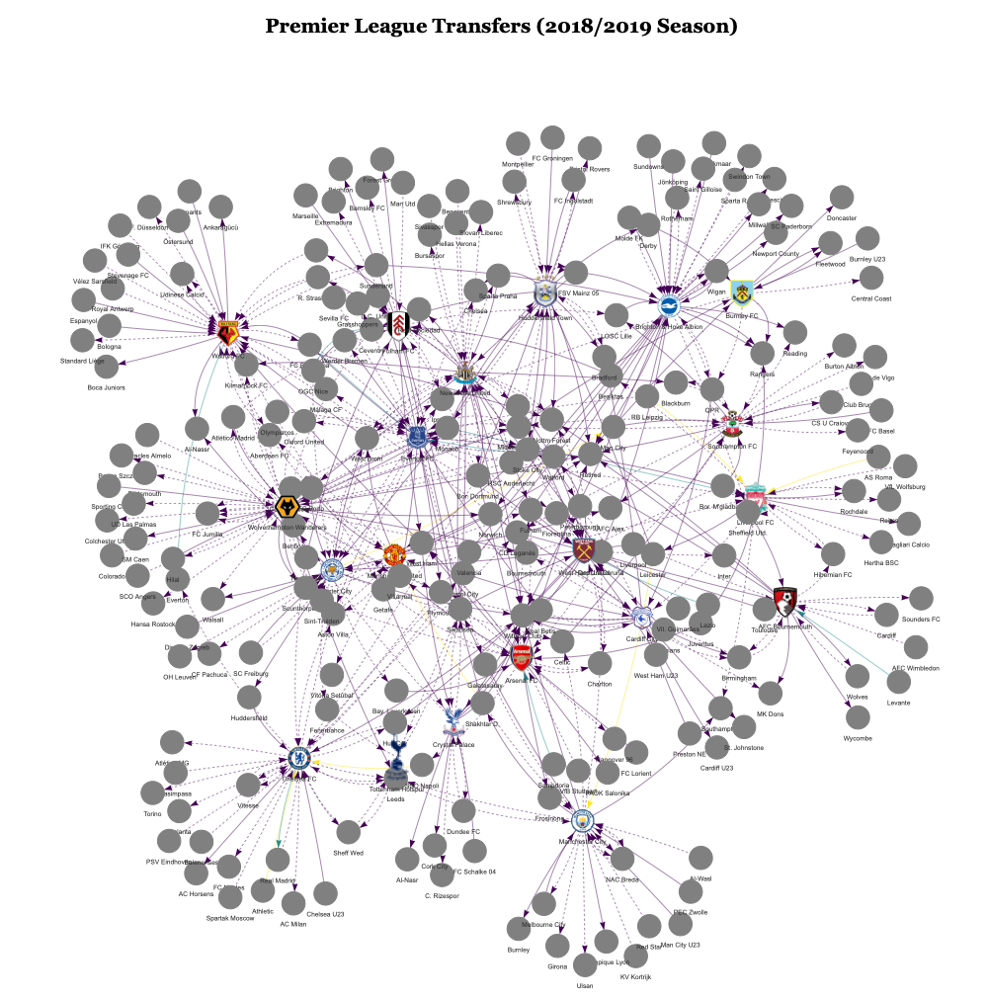

## transfermarktR
#### A R Package for quick access to transfer football data sourced from transfermarkt website.

The package allows the user to explore the football transfer market for different seasons, transfer windows (summer and winter) and most importantly Leagues. 
It aims to work to any league covered on the transfermarkt website and all the user has to provide is the relevant link. In the future, the user will be able to choose from a list of leagues from within R. 

The package contains two functions:

- **get_transfers()** - Used to collect the data in the form of a data-frame. See the function help files for extra information on the arguments to be parsed.

- **Transfers_NetworkPlot()** - This function uses the collected data-frame as input to generate a Network Visualisation of the transfer window analysed. The visualisation is interactive (see static sample below) and generated with the help of the awsome [visNetwork](https://datastorm-open.github.io/visNetwork/) library. In the network plot, edges represent player transfers and can be analysed in detail by hovering on top, whilst nodes represent football clubs. Clubs from the league being analysed contain icons as well.

Additionally, dashed lines represent Loans whilst normal lines represent Transfers. The color of the edge represents the relative value of the transfer (taking into account all the transfers in the plot). Gree
